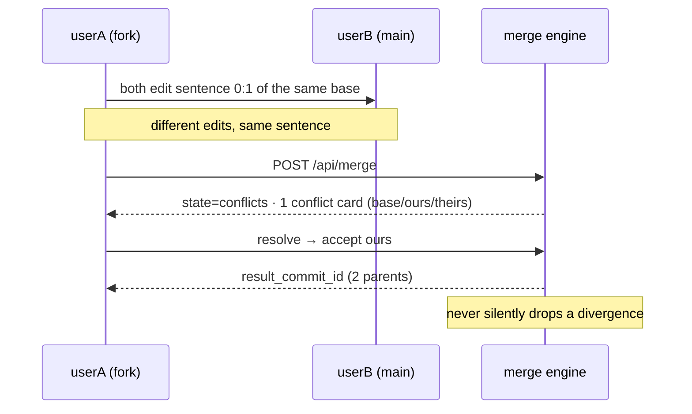

<div align="center">

# 🔬 ReGit

### Version control, designed for research instead of source code.

**Typed artifacts · content-addressed history · semantic diff · 3-way merge · CRDT live editing · provenance · version-aware retrieval**

*No LLM in any correctness path. 100% deterministic.*

[](#)
[](#)
[](#)
[](#)
[](#)
[](#)
[](#-tests)

*Gradient Rush Hackathon 2026 · AI/ML Club · Scaler School of Technology*

---

</div>

> Git solved version control for code. Nobody solved it for research.
>
> **ReGit** treats research artifacts — docs, LLM chats, PDFs, codebases — as first-class typed versioned objects, with live collaboration, provenance, and retrieval that understands history.

---

## 🧩 The four pillars

| | | |
|---|---|---|
| 🧬 **Versioning** | content-addressed DAG · branches · **semantic diff** · **3-way prose merge** | SHA-256 blobs · LCS over sentence hashes · Git-exact conflict cards |
| 🤝 **Collaboration** | **CRDT** live editing · presence · commit-from-live | pycrdt ↔ yjs · convergence invariant · persisted op log |
| 📥 **Ingestion** | Markdown · ChatGPT · Claude · PDF · codebase | structure-preserving canonical payloads · content-addressed dedup |
| 🔎 **Retrieval** | hybrid **BM25 + vector** search · citations · time-travel | delta-reindex per commit · `as_of_commit` filter |

---

## 🏗 Architecture

```
 Browser (React) · userA + userB, two tabs, one room
   │  REST /api                 WS /api/collaborate/:id
   ▼
 FastAPI (one uvicorn worker)
 ├─ core/objects        blobs · commit DAG · branches · merge-base
 ├─ core/diff           align.py ── the shared sentence/paragraph spine
 ├─ core/merge          three_way.py ── decision table + conflict cards
 ├─ core/collaboration  pycrdt docs · locks · commit-from-live
 ├─ ingestion/          canonical typed payloads
 ├─ retrieval/          chunkers · delta indexer · hybrid search
 └─ provenance/         claim ← commit ← artifact ← source
      ▼
 data/  (fully offline, one process)
   ├─ objects/  SHA-256 zlib blobs
   ├─ meta.db   SQLite WAL (objects, commits, refs, chunks, crdt_ops)
   └─ vectordb  embedded Chroma + MiniLM (one-time download at setup)
```

**One alignment engine (`align.py`) powers three systems** — semantic diff, 3-way merge, retrieval reindex. Tested once, pays three times.

---

## 🚀 Quick start

```bash
# cross-platform (Windows / macOS / Linux) — no bash needed:
python scripts/setup.py        # or: py scripts/setup.py  (Windows)
#   ...or on mac/linux with bash:  bash scripts/setup.sh

uv run uvicorn backend.src.api.main:app --port 8377   # backend + frontend, offline
cd frontend && npm install && npm run dev      # dev mode (optional, :5173)
```

CLI: `python -m backend.src.cli init|seed|verify|show <artifact_id>`  *(offline demo fallback; richer flows live in the API/UI)*

---

## 🎬 The demo moment (3 min)



Two branches, same sentence, two different edits → **one conflict card** → resolve → **2-parent merge commit**. Judges ask for a live merge conflict and a live semantic diff first. Both scripted, both shippable.

---

## 🧪 Tests

`uv run python -m pytest tests/ -q` → **120 passing**

| Invariant | With |
|---|---|
| objects append-only + immutable | `test_invariants` |
| merge never silently drops | `test_invariants` |
| CRDT convergence (shuffle/dup/out-of-order) | `test_collab` |
| live merge-conflict → resolve → 2-parent commit | `test_merge_flow` |
| two-client WS relay (real uvicorn) | `test_collab_ws` |
| hybrid search + `as_of` time-travel | `test_retrieval_vector` |

---

## 📚 Docs

| Read | For |
|---|---|
| [**EXPLAINER.md**](docs/EXPLAINER.md) | the full story, mentor-ready |
| [architecture.md](docs/architecture.md) · [data-model.md](docs/data-model.md) | how it works, exactly |
| [**adr/**](docs/adr/) · [**specs/**](docs/specs/) | every choice, every contract |
| [demo/demo-script.md](docs/demo/demo-script.md) · [judge-qa.md](docs/demo/judge-qa.md) | the 8-scene demo + judge prep |

---

## 📈 Status

**4 of 4 pillars done + stretch. Backend + frontend integrated, live-verified, fully tested.**

✅ done · ❌ out of scope (per brief): real auth, OCR, custom vector DB.
Beyond-scope next: cross-artifact claim propagation, agent editing branches (detail in [EXPLAINER.md](docs/EXPLAINER.md)).

---

<div align="center">

Built by **Muneer Alam** & **Amrit Kang** · [MIT](LICENSE)

</div>
